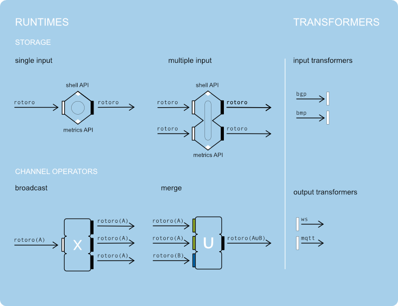
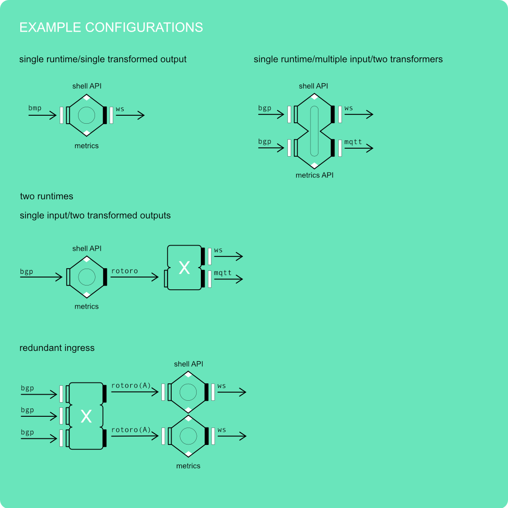

ROTONDA
=======

Modular programmable BGP routing services

Components & Libraries
======================

Rotonda consists of a set of types of components that can be mixed and matched to build a BGP routing service. You can build one big stand-alone application, or you can build a set of distributed runtimes that are communicating through the `rotoro` ("Rotonda to Rotonda") protocol.

| Component | Description |
|----------|-------------|
| Rotonda-runtimes       | Stand-alone daemons, that wrap the rotonda-stores in APIs, inbound/outbound connections |
| Rotonda-transformers   | Stateful plug-ins that transform the interal ro-to-ro protocol into other protocols/formats and vice versa |

| Library | Description |
|---------|-------------|
| Rotonda-store         | RIB-like in-memory storage data-structures, keyed by prefix |
| Routecore             | BGP/BMP parsers |
| rotorotoro            | `rotoro` protocol broker |

Key:

    ✅ -- phase complete
    🦀 -- phase in progress
    💤 -- phase not started yet

Rotonda-store
=============

| Stage | State | Artifacts |
|:----:|:----:|:--------:|
| Proposal | ✅ | this document |
| Experimental | ✅ | [blog post repo](https://github.com/NLnetLabs/try-tries-and-trees) |
| Development | ✅ | [repo](https://github.com/NLnetLabs/rotonda-store) |
| Feature complete | 🦀 | [repo](https://github.com/NLnetLabs/rotonda-store) |
| Stabilized | 💤 |  |

Rotonda-store is a library that hosts data-structures that stores prefixes and attached meta-data, whil establishing the hierarchy of the prefixes. It can be queried for exactly and longest-matching prefixes, as well as less-specific and more specific prefixes.

Currently there are two main data-structures, a store thats meant to be used in single-threaded contexts and a store that is useful for multi-threaded contexts. The API for both data-structures is the same. The API is based on the `Prefix` type from the `Routecore` crate. It abstracts over IPv4 and IPv6 prefixes, although internally they are kept in two different data-structures (treebitmaps).

The single-threaded store is backed by two global vecs that host the nodes in the tree and the bitmap. The multi-threaded store is either backed by a concurrently writable hash-table or a concurrent-hash-map (from the `dashmap` crate).

Routecore
=========

| Stage | State | Artifacts |
|:----:|:----:|:--------:|
| Proposal | ✅ | this document |
| Experimental | ✅ | |
| Development | ✅ |  |
| Feature complete | ✅ | |
| Stabilized | 💤 |  [repo](https://github.com/NLnetLabs/routecore) |

Routecore is a library that holds types that are shared between rotonda, routinator, krill, that are related to routing.

Rotoro protocol
===============

| Stage | State | Artifacts |
|:----:|:----:|:--------:|
| Proposal | ✅ | this document |
| Experimental | 💤 | |
| Development | 💤 |  |
| Feature complete | 💤 | |
| Stabilized | 💤 | |

Rotoro is the protocol that connects Rotonda-runtimes, inpired by the rtr-protocol. Rotoro allows for receiving/sending full state (snapshots) or diffs from runtime to runtime. A rotoro channel sends/receives of one single type, but it can be merged with another into a third type with the aid of a channel operator runtime.

Rotonda-runtimes
================

| Stage | State | Artifacts |
|:----:|:----:|:--------:|
| Proposal | ✅ | this document |
| Experimental | 💤 | [roto-ris-live](https://github.com/NLnetLabs/roto-ris-live) |
| Development | 💤  | |
| Feature complete | 💤 | |
| Stabilized | 💤 |  |

The Rotonda-runtimes are stand-alone binaries that can be run as separate applications that communicate over a dedicated channel with the aid of the internal `rotoro` protocol, a rtr-like protocol. The fall into two categories: storage runtimes and channel operators.

Storage runtimes are applications that wrap a rotonda-store data-structure in a few (JSON-over-HTTP) APIs, that are used for querying and storing prefixes, configuration, metrics, downloading/uploading snapshots, etc. and input and inbound and outbound connections. The Storage runtimes only speak the ro-to-ro internal protocol. Furthermore a single-input runtime can only feature one inbound connection and one outbound connection. A multi-input runtime can have multiple inbound connections and multiple outbound connections. In both cases the connections can only handle one payload type for inbound and outbound connections.

The channel operators are applications that either merge two `rotoro` channels into one, or conversely broadcast one ro-to-ro channel to multiple outputs.
When merging two or more channels the input channels can be of different types. The output type will be another type that can be the union of all input types, or they can have specialized merge-functions to go from several input types to one output type. The channel operators can also only speak the ro-to-ro internal protocol.

Several runtimes can be combined into one runtime, in that case the ro-to-ro serialization and sending/receiving of messages is superfluous.

Transformers
============

| Stage | State | Artifacts |
|:----:|:----:|:--------:|
| Proposal | ✅ | this document |
| Experimental | 💤 | |
| Development | 💤 | |
| Feature complete | 💤 | |
| Stabilized | 💤 |  |

Transformers transform the ro-to-ro internal protocol into other protocols/formats and vice versa. They can hold state about the protocol, e.g. BGP connection state. The get plugged into any of the rotonda-runtimes.

