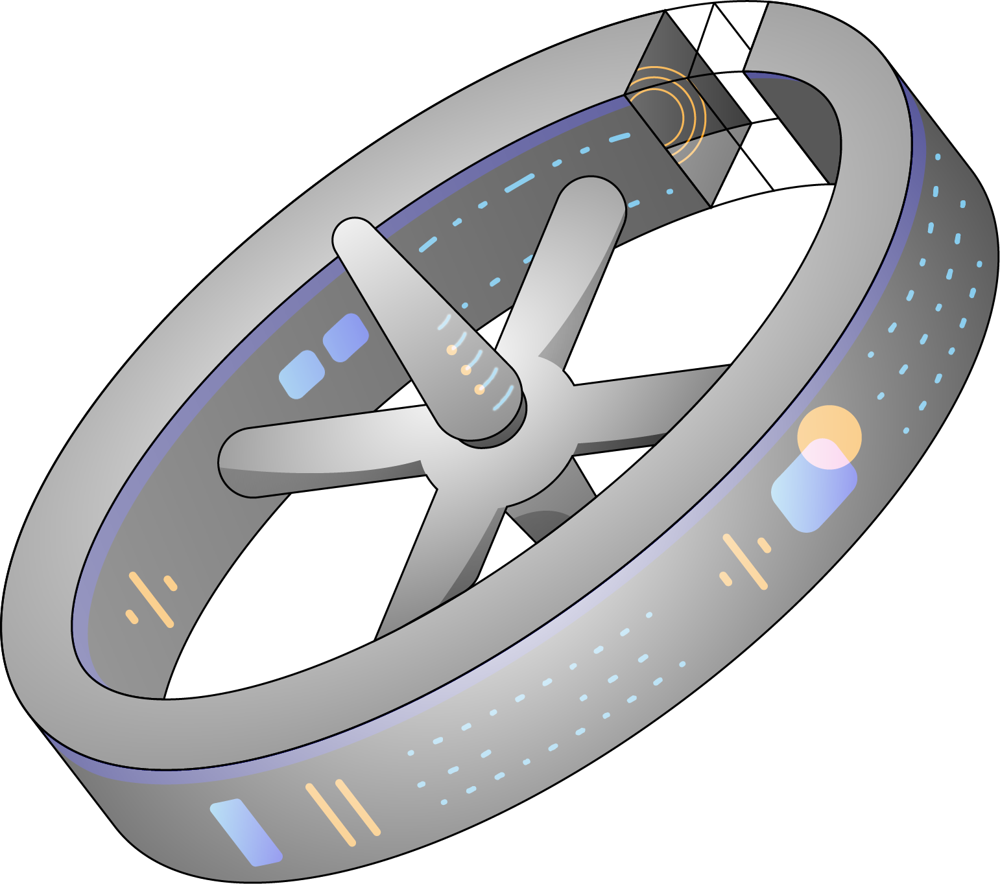

# Rotonda

The composable, programmable BGP Engine

The current version of Rotonda allows you to open BGP and BMP sessions and
collect incoming routes from many peers into a in-memory database, modeled as
a Routing Information Base (RIB). It also supports importing routes from MRT
files into this database. Conditions for accepting incoming routes and sending
messages to log files or a MQTT stream can be created using filters with the
`Roto` programming language. The RIB can be queried through an HTTP/JSON
API.

Future versions of Rotonda will support an on-disk database, using external
datasets in filters, reading routes from Kafka streams, and more.

Read the [documentation](https://rotonda.docs.nlnetlabs.nl) to find out how to
install and use Rotonda.

> `Rotonda` is under active development and features are added regularly.
> The APIs, the configuration and the `Roto` syntax may change between
> 0.x versions.
>
> For more information on upcoming features and changes see the 
> [ROADMAP](ROADMAP.md)

Modularity
   Rotonda applications are built by combining units into a pipeline through
   which BGP data will flow. You can filter, and store the BGP data along
   the way, and create signals based on it to send to other applications. We
   aim for units to be hot-swappable, i.e. they can be added and removed in a
   *running* Rotonda application.

   Rotonda offers units to create BGP and BMP sessions, Routing Information
   Bases (RIBs), and more.

Flexibility
   The behaviour of the units can be modeled by using a small, fun programming
   language called `Roto`, that we created to combine flexibility and
   ease-of-use. Right now, `Roto` is used define filters that run in the hot
   path of the Rotonda pipeline. It's our goal to integrate filter definition,
   configuration syntax, and query syntax into `Roto` scripts in one place.
   Modifying, versioning and provisioning of your `Roto` scripts should be
   as straight forward as possible.

Tailored Performance
   Rotonda aims to offer units that perform the same task, but with different
   performance characteristics, so that you can optimize for your needs, be it
   a high-volume, low latency installation or a small installation in a
   constraint environment.

Observability
   All Rotonda units will have their own finely-grained logging capabilities,
   and some have built-in queryable JSON API interfaces to give information
   about their current state and content through Rotonda’s built-in HTTPS
   server. Signals can be sent to other applications. Moreover, Rotonda aims
   to offer true observability by allowing the user to trace BMP/BGP packets
   start-to-end through the whole pipeline.

Storage Persistence
   By default a Rotonda application stores all the data that you want to
   collect in memory. It should be possible to configure parts to persist
   to another storage location, such as files or a database. Whether you put
   RIBs to files or in a database, you can should still be able to query it
   transparently with `Roto`.

External Data Sources
   `Roto` filter units should be able to make decisions based on real-time
   external data sources. Similarly filter units should be ahlt to make
   decisions based on data present in multiple RIBs. External data sources
   can be, among others, files, databases or even a RIB backed by an RTR
   connection.

Robustness & Scalability
   Multiple Rotonda instances should be able to synchronize or shard data via
   a binary protocol, that we dubbed `rotoro`.

Security & Safety
   Rotonda applications will be able to use data provided by the RPKI through
   connections with tools like Routinator and Krill. Besides that, Rotonda
   supports BGPsec out of the box. Again, no patching or recompiling required.

### External Data Sources
### Open-source with professional support services

NLnet Labs offers [professional support and consultancy
services](https://www.nlnetlabs.nl/services/contracts/) with a service-level
agreement. Rotonda is liberally licensed under the
[Mozilla Public License 2.0]
(https://github.com/NLnetLabs/rotonda/blob/main/LICENSE).
