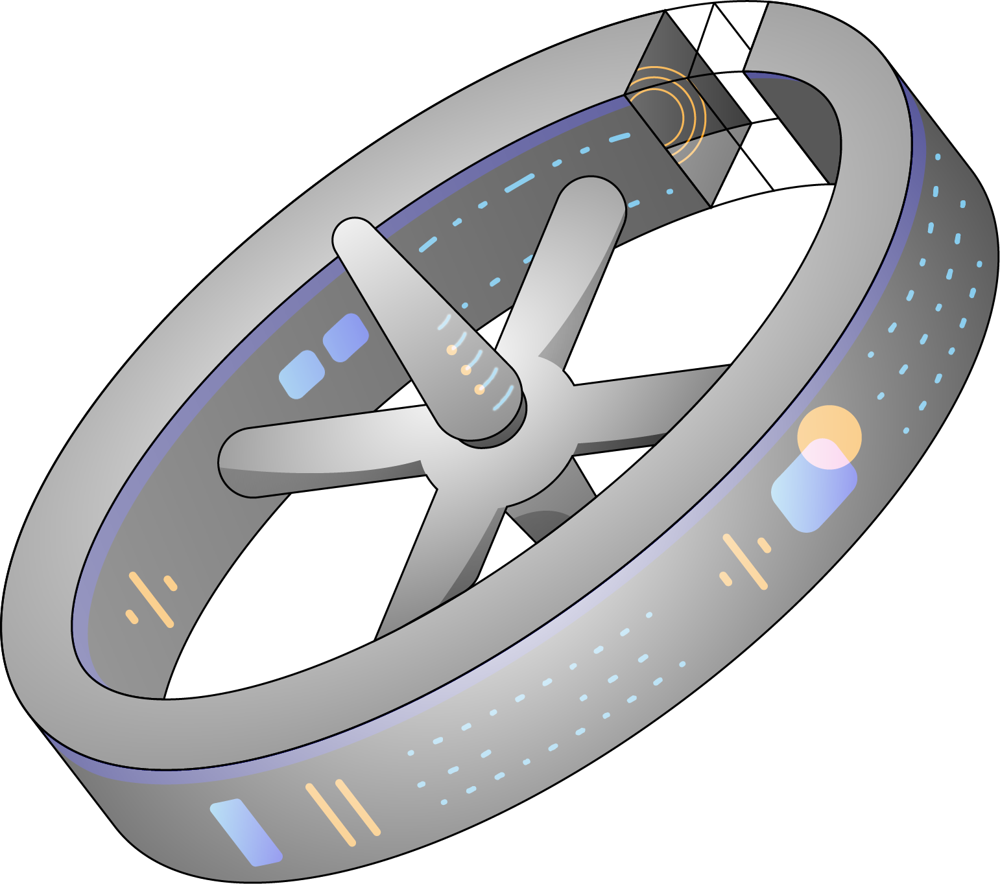

# Rotonda

Roll your own BGP service application with Rotonda. 

BGP services that you can build with Rotonda include, but are not
limited to, a route monitor|collector|server|reflector, all this without
modifying a single line in the source code of Rotonda. Rotonda is and always
will be free, open-source software.

>### ROTONDA IS CURRENTLY IN ALPHA, DO NOT USE IN PRODUCTION
>
> Rotonda is being actively worked on and this repository and all the packages
> we supply are still in ALPHA stage. Use it to experiment freely (we value your
> feedback!), but do not use it with data and data-streams you cannot afford
> to lose.
>
> You should also be aware that all the APIs, configuration and the `roto`
> syntax and grammar are still (highly) unstable.
>
> For more information see the [ROADMAP](ROADMAP.md)
